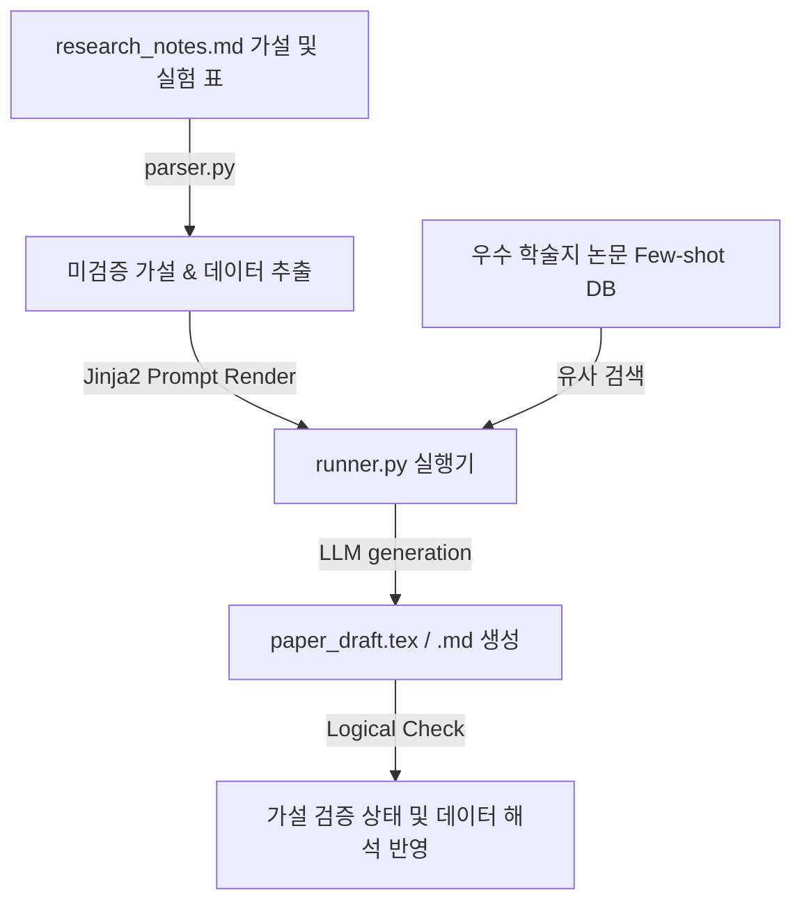

# 🔬 학술 연구 논문 및 특허 명세서 작성 하네스 설계서 (Academic Research Harness)

본 설계서는 실험 관측 데이터 테이블 및 미검증 가설 대장 파일로부터 학술적 인과 관계를 추론하고, 저널 등재 규격(IEEE, Nature 등)의 논문 초안 및 특허 청구항 서류를 기획·서술하는 하네스 아키텍처 명세입니다.

---

## 🏗️ 1. 아키텍처 흐름

---

## 🗂️ 2. 데이터 컴포넌트 설계

### 2.1 가설 및 관측 데이터 대장 (`research_notes.md`)
세부 가설 목록과 실험군/대조군 관측 결과를 연동하여 관리하는 단일 진실원(SSOT) 문서입니다.

| 가설 ID | 핵심 가설 내용 | 실험 관측 데이터 (수치) | 논리적 검증 근거 | 현재 상태 |
| :--- | :--- | :--- | :--- | :--- |
| HYP-01 | 신소재 A 결합 시 마찰 계수가 15% 감소할 것임 | 마찰계수 0.12 (대조군 0.15 대비 20% 감소) | 실험 3차 반복 평균값 일치 | `🟢 검증 완료` |
| HYP-02 | 고온 노출 시 격자 팽창으로 전도율이 증가할 것임 | 전도율 5.2 S/m (기존 수치 유지) | 격자 상수에 미치는 열 에너지 영향 파악 필요 | `🔴 가설 미검증` |
| HYP-03 | 진공도 10^-6 Torr 이상에서 표면 흡착이 차단됨 | 데이터 수집 및 노이즈 필터링 진행 중 | 진공 챔버 압력 강하 데이터와 공명 분석 중 | `🟡 분석 중` |

---

## ⚙️ 3. 코드 엔진 설계 및 분기

1. **`parser.py` (실험 데이터 스캐너)**:
   - `research_notes.md` 파일에서 `현재 상태`가 `🔴 가설 미검증` 및 `🟡 분석 중`인 가설과 연동된 관측 수치 데이터(JSON 포맷화)를 스캔해옵니다.
2. **`humanizer_db.py` (우수 학술 저널 Few-shot DB)**:
   - 타겟으로 삼는 SCI급 저널에 게재 완료된 우수 논문의 서론, 본론, 고찰 작성 예시를 수집 및 임베딩 처리하고, 현재 검증 중인 가설의 학술 분야와 유사도가 높은 문체 예제를 가져옵니다.
3. **`runner.py` (논리 기술 빌더)**:
   - 프롬프트에 학술적 엄밀함 수호 규칙(수치 왜곡 금지, 인과 오류 방지 지침 등)을 결합하여, 논문 표준 문체(예: Passive Voice, 객관화된 명사 표현)로 `paper_draft.md`에 논술 초고를 자동 생산하고 검증 진행 상황을 업데이트합니다.
