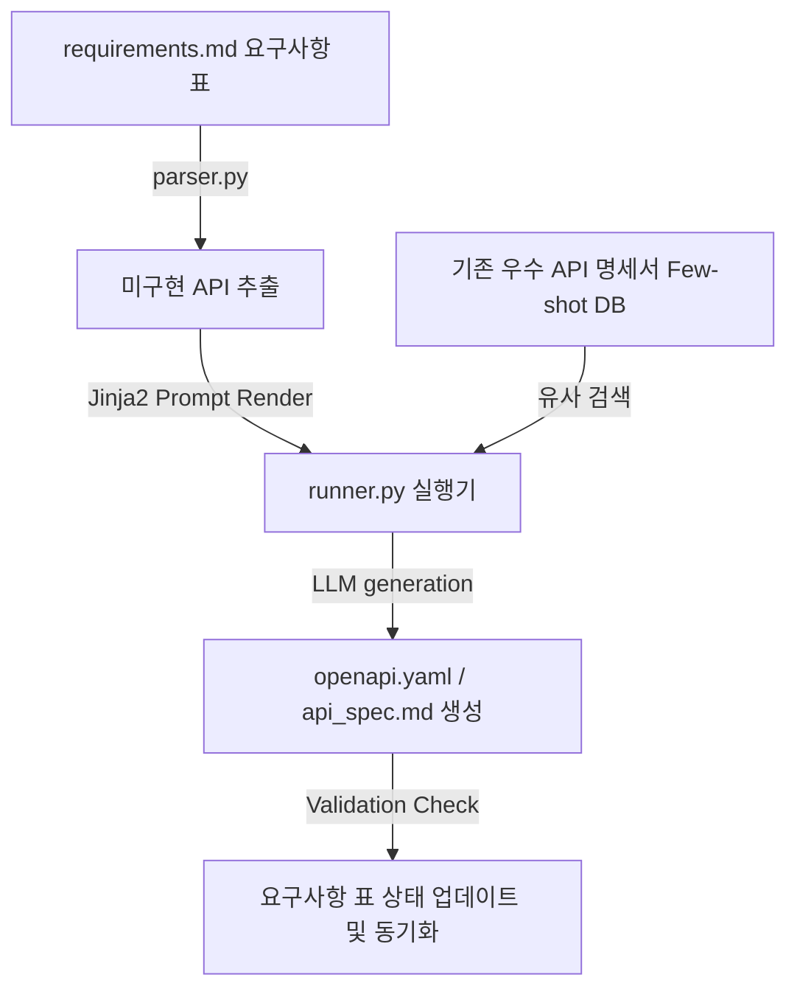

# ⚙️ API 명세서 자동 생성 하네스 설계서 (API Specification Harness)

본 설계서는 기획서 및 요구사항 마크다운 표로부터 OpenAPI(Swagger) 규격의 고품질 API 명세서를 자동으로 개발하고 변경 상태를 제어하는 하네스 아키텍처에 대한 명세입니다.

---

## 🏗️ 1. 아키텍처 흐름

---

## 🗂️ 2. 데이터 컴포넌트 설계

### 2.1 요구사항 상태 관리 대장 (`requirements.md`)
개발할 API 엔드포인트의 요구사항 상태를 표(Table)로 관리하는 단일 진실원(SSOT) 문서입니다.

| ID | API 경로 | HTTP 메서드 | 기능 정의 | 개발 담당 | 현재 상태 |
| :--- | :--- | :--- | :--- | :--- | :--- |
| API-01 | `/api/v1/auth/login` | `POST` | 사용자 로그인 및 JWT 발급 | 제갈개발 | `🟢 개발 완료` |
| API-02 | `/api/v1/posts` | `GET` | 게시글 필터링 검색 및 페이징 조회 | 백운개발 | `🔴 미구현` |
| API-03 | `/api/v1/users/profile`| `PUT` | 프로필 사진 업로드 및 정보 수정 | 야화개발 | `🟡 테스트 중` |

---

## ⚙️ 3. 코드 엔진 설계 및 분기

1. **`parser.py` (요구사항 스캐너)**:
   - `requirements.md` 파일에서 `현재 상태` 열의 값이 `🔴 미구현` 및 `🟡 테스트 중`인 행만 스캔하여 파이썬 딕셔너리 리스트로 변환합니다.
2. **`humanizer_db.py` (우수 API 명세 퓨샷 DB)**:
   - 개발사에서 작성된 기존의 고품질 API 명세서(성공적인 YAML 또는 Markdown 예시)를 적재해두고, 작성할 엔드포인트와 기능이 유사한 실례를 검색하여 문맥에 제공합니다.
3. **`runner.py` (OpenAPI 빌더)**:
   - Jinja2 템플릿에 요구사항 데이터와 퓨샷 명세서를 주입하여 올바른 OpenAPI 3.0 YAML 포맷으로 1차 생성합니다.
   - 사후 검증으로 YAML 구문 파서(PyYAML)를 구동하여 구문 에러를 1차 필터링하고 에러가 없을 시에만 `openapi.yaml`에 반영 및 `requirements.md` 상태를 `🟡 테스트 중`으로 자동 업데이트합니다.
