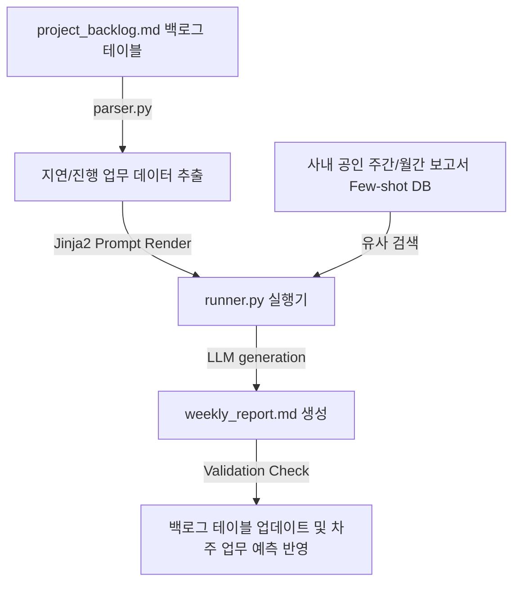

# 📊 기업 주간 보고서 자동화 하네스 설계서 (Corporate Report Harness)

본 설계서는 프로젝트 관리 보드(Jira 등)에서 파싱된 업무 마일스톤 및 지연 태스크 테이블로부터 실적과 이슈 현황을 감지하여, 임원 및 고객 대상의 완성도 높은 주간 업무 보고서를 정형화해 출력하는 하네스 아키텍처 명세입니다.

---

## 🏗️ 1. 아키텍처 흐름

---

## 🗂️ 2. 데이터 컴포넌트 설계

### 2.1 마일스톤 및 태스크 백로그 대장 (`project_backlog.md`)
프로젝트 세부 과제의 진척 상황과 책임자, 지연 원인을 투명하게 기록해 관리하는 단일 진실원(SSOT) 문서입니다.

| 태스크 ID | 핵심 과제명 | 담당 부서 | 차질 원인 및 이슈 사항 | 진척도 (%) | 현재 상태 |
| :--- | :--- | :--- | :--- | :--- | :--- |
| TASK-101 | 고객 지원 센터 모바일 웹 최적화 | UX 디자인팀 | 검수 피드백 대기 중 | 90% | `🟡 진행 중` |
| TASK-102 | 결제 모듈 복합 인증 연동 | 백엔드 개발팀 | 외부 PG사 API 연동 테스트 환경 다운 | 45% | `🔴 지연 과제` |
| TASK-103 | 레거시 데이터 마이그레이션 | DB인프라팀 | - | 100% | `🟢 완료 과제` |

---

## ⚙️ 3. 코드 엔진 설계 및 분기

1. **`parser.py` (백로그 스캐너)**:
   - `project_backlog.md` 파일에서 `현재 상태`가 `🔴 지연 과제`이거나 `🟡 진행 중`인 과제의 ID, 진척도 및 `이슈 사항` 텍스트를 JSON 형태로 정밀 가공하여 로드합니다.
2. **`humanizer_db.py` (비즈니스 서식 Few-shot DB)**:
   - 사내에서 가장 격식 있게 잘 쓰인 주간/월간 업무 보고서 또는 고객용 사업 진척 보고서 양식과 실무 서술 예시를 파싱해 두고, 현재 직면한 이슈 사항과 매칭되는 가장 정제된 기업형 화법(Corporate Tone) 예제를 추출합니다.
3. **`runner.py` (주간 실적 기술기)**:
   - 프롬프트에 비즈니스 보고서 10계명(예: 두괄식 전개, 지연 원인을 객관적으로 소명하고 구체적 대안 제시 규칙)을 결합합니다.
   - LLM이 당사 과실을 방어하며 향후 조치 방안을 설득력 있게 적은 보고서 초안 `weekly_report.md`를 자동 생산하고 차주 계획 예측을 백로그 대장에 동기화합니다.
