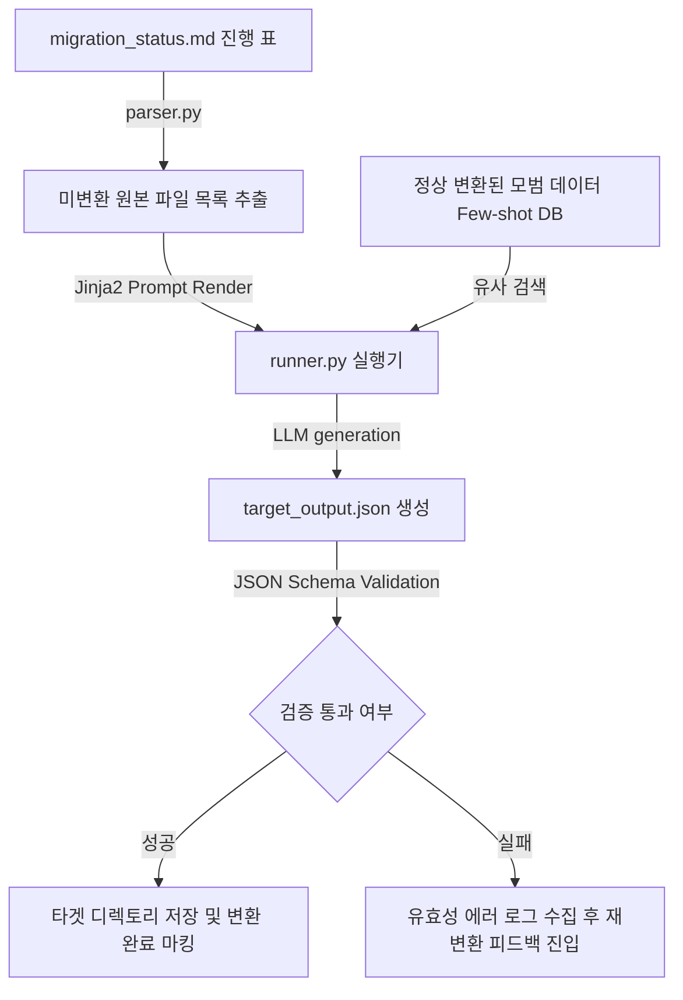

# 🗄️ 데이터 마이그레이션 및 스키마 변환 하네스 설계서 (Data Migration Harness)

본 설계서는 기획자/운영자가 남긴 구형 비정형 텍스트(CSV, XML, 예전 포맷 마크다운 등)를 신규 정형 스키마(JSON, clean Markdown, YAML 등) 규격에 맞춰 일괄 가공하고, 스키마 정적 유효성 검증을 거쳐 데이터의 100% 동작을 보장한 뒤 이력을 싱크하는 마이그레이션 하네스 아키텍처 명세입니다.

---

## 🏗️ 1. 아키텍처 흐름

---

## 🗂️ 2. 데이터 컴포넌트 설계

### 2.1 마이그레이션 진척도 대장 (`migration_status.md`)
변환할 대상 원본 파일 경로와 변환 결과 스키마 검증 통과 이력을 실시간 관리하는 단일 진실원(SSOT) 문서입니다.

| 파일 ID | 원본 소스 파일 경로 | 타겟 변환 스키마 규격 | 스키마 밸리데이터 오류 | 현재 상태 |
| :--- | :--- | :--- | :--- | :--- |
| MIG-01 | `legacy/data_user_1.xml` | `schema/user_profile.json` | 없음 (정상) | `🟢 변환 완료` |
| MIG-02 | `legacy/posts_archive.csv`| `schema/post_layout.json` | - | `🔴 변환 대기` |
| MIG-03 | `legacy/settings_v1.txt` | `schema/app_config.json` | `Required field 'port' missing` | `🔴 스키마 에러` |

---

## ⚙️ 3. 코드 엔진 설계 및 분기

1. **`parser.py` (마이그레이션 스캐너)**:
   - `migration_status.md` 파일에서 `현재 상태`가 `🔴 변환 대기` 또는 `🔴 스키마 에러`인 소스 파일의 물리 경로와 타겟 스키마 규칙을 수집합니다.
2. **`humanizer_db.py` (표준 스키마 매핑 퓨샷 DB)**:
   - 기존에 변환 완료된 XML ➡️ JSON 또는 CSV ➡️ JSON 예제를 데이터 구조별로 적재해 두고, 현재 변환할 포맷과 가장 성격이 겹치는 모범 변환 쌍을 찾아 제공합니다.
3. **`runner.py` (스키마 밸리데이터 및 변환기)**:
   - Jinja2 템플릿에 원본 텍스트 데이터와 변환 스키마 제약 규칙을 주입하여 가공 코드를 실행시킵니다.
   - 변환된 결과물(JSON 등)에 대해 **[JSON Schema Validator]** 라이브러리를 가동하여 필수 필드가 빠졌거나 타입이 잘못되었는지 자동 검증합니다.
   - 통과할 때까지 피드백 재시도(최대 3회)를 수행하며, 통과 시 최종 결과 디렉터리에 파일을 안전하게 쓰고 이력을 마킹합니다.
