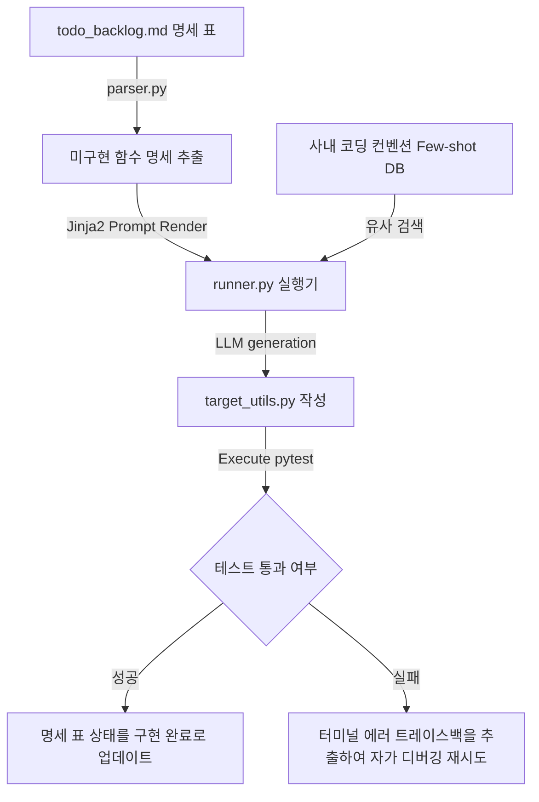

# 💻 초경량 마이크로 개발 하네스 설계서 (Micro Coding Harness)

본 설계서는 특정 유틸리티 함수나 단일 클래스의 요구 명세 표로부터 프로덕션 코드를 자동 생성하고, 유닛 테스트(pytest 등) 실행 에러 피드백을 기반으로 코드를 스스로 디버깅하여 성공 통과시키는 초경량 개발 하네스 아키텍처 명세입니다.

---

## 🏗️ 1. 아키텍처 흐름

---

## 🗂️ 2. 데이터 컴포넌트 설계

### 2.1 함수 명세 및 백로그 대장 (`todo_backlog.md`)
구현할 타겟 함수 명세와 테스트 통과 진척 상황을 관리하는 단일 진실원(SSOT) 문서입니다.

| 함수 ID | 함수 시그니처 (명세) | 인자 및 리턴 타입 | 검증 테스트 파일 | 현재 상태 |
| :--- | :--- | :--- | :--- | :--- |
| DEV-01 | `calculate_tax` | `income: int -> float` | `tests/test_tax.py` | `🟢 구현 완료` |
| DEV-02 | `parse_user_agent`| `ua_string: str -> dict` | `tests/test_ua.py` | `🔴 미구현` |
| DEV-03 | `encrypt_payload` | `data: dict -> str` | `tests/test_crypto.py` | `🟡 디버깅` |

---

## ⚙️ 3. 코드 엔진 설계 및 분기

1. **`parser.py` (함수 명세 스캐너)**:
   - `todo_backlog.md` 파일에서 `현재 상태`가 `🔴 미구현` 또는 `🟡 디버깅`인 항목을 파싱하여 함수 시그니처와 구현 목적 텍스트를 구조화합니다.
2. **`humanizer_db.py` (코딩 규격 Few-shot DB)**:
   - 프로젝트에서 요구하는 깔끔하고 에러 핸들링이 완벽한 모범 코드 예제(Few-shot)를 로드하여 프롬프트에 제공합니다.
3. **`runner.py` (코드 젠 및 자가 디버깅 실행기)**:
   - Jinja2 템플릿에 명세 데이터와 Few-shot 코드를 주입하여 타겟 파일에 파이썬 함수 코드를 작성합니다.
   - 직후 `subprocess`를 통해 로컬 유닛 테스트(`pytest {테스트파일}`)를 자동 실행합니다.
   - 실패 시 리턴된 **에러 트레이스백(Traceback)**을 LLM 피드백으로 전달하여 코드를 스스로 수정한 후 재시도(최대 3회)하며, 성공 시 상태를 `🟢 구현 완료`로 업데이트합니다.
