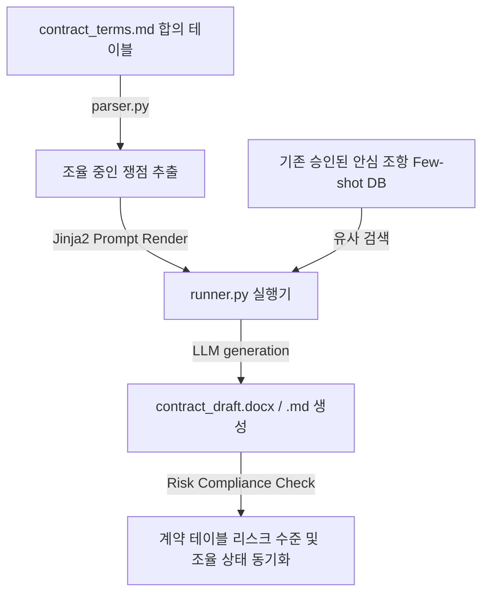

# ⚖️ 법률 계약서 및 조항 조율 하네스 설계서 (Legal Contract Harness)

본 설계서는 복잡한 비즈니스 합의 조건 테이블 및 특약 사항 파일로부터 독소 조항과 법률적 리스크를 실시간 감지하여 방어하고, 표준 정형 문장으로 법률 서류 초안을 작성하는 하네스 아키텍처 명세입니다.

---

## 🏗️ 1. 아키텍처 흐름

---

## 🗂️ 2. 데이터 컴포넌트 설계

### 2.1 특약 및 합의 조항 대장 (`contract_terms.md`)
계약 당사자 간의 합의 조율 상태와 개별 쟁점 항목을 표(Table)로 관리하는 단일 진실원(SSOT) 문서입니다.

| 조항 ID | 구분 | 핵심 요구 합의 내용 | 리스크 등급 | 상대방 입장 및 피드백 | 현재 상태 |
| :--- | :--- | :--- | :--- | :--- | :--- |
| CON-01 | 지식재산권 | 개발 결과물의 지적재산권은 당사에 귀속됨 | `🟢 안전` | 무조건 동의함 | `🟢 합의 완료` |
| CON-02 | 지체상금 | 납기 지연 시 일당 계약금의 3% 페널티 부과 | `🔴 위험` | 페널티 비율 완화 요구 중 | `🔴 조율 중` |
| CON-03 | 계약 해지 | 천재지변 시 해지 통보 후 7일 이내 해지 가능 | `🟡 주의` | 해지 효력 개시 14일 연장 주장 | `🟡 조율 중` |

---

## ⚙️ 3. 코드 엔진 설계 및 분기

1. **`parser.py` (리스크 조항 스캐너)**:
   - `contract_terms.md` 파일에서 `현재 상태` 열의 값이 `🔴 조율 중`이면서 `리스크 등급`이 `🔴 위험` 또는 `🟡 주의`인 조항을 스캔하여 파이썬 구조체로 로드합니다.
2. **`humanizer_db.py` (법률 안심 조항 퓨샷 DB)**:
   - 로펌이나 법무팀에서 사전에 승인 완료한 표준 안심 특약 문구(Few-shot 조항집)를 벡터 DB에 적재해두고, 현재 발생한 쟁점 조항과 카테고리가 겹치는 안전 대체 문구를 검색합니다.
3. **`runner.py` (법률 윤문 및 리스크 통제기)**:
   - 독소 조항 방지 지침서(`.agents/rules/legal_rules.md`)에 정의된 감시 규칙을 프롬프트에 동적 결합합니다.
   - LLM이 쟁점 조항을 법률 표준 문맥으로 순화하여 당사 이익을 방어하는 대안 조항(Draft)을 작성하게 하고, 최종 확인 후 `contract_draft.md`에 작성하며 `contract_terms.md` 내 리스크 상태를 동기화합니다.
