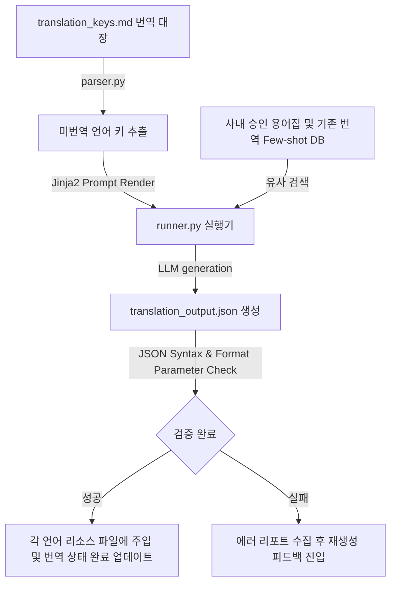

# 🌐 다국어 로컬라이징 번역 하네스 설계서 (Localization Harness)

본 설계서는 신규 서비스 다국어 번역 키 대장으로부터 누락된 언어별 번역을 감지하고, 기존 번역 톤앤매너 및 전문 용어 사전(Glossary)을 투영하여 자연스러운 현지어 원고를 완성한 뒤 JSON 리소스 파일 구문을 검증하여 백싱크하는 하네스 아키텍처 명세입니다.

---

## 🏗️ 1. 아키텍처 흐름

---

## 🗂️ 2. 데이터 컴포넌트 설계

### 2.1 다국어 번역 키 및 상태 대장 (`translation_keys.md`)
애플리케이션 내 다국어 문자열의 원본(한국어) 및 타겟 언어별 진척 상태를 모니터링하는 단일 진실원(SSOT) 문서입니다.

| 번역 키 ID | 원본 텍스트 (ko) | 영어 (en) 상태 | 일본어 (ja) 상태 | 중국어 (zh) 상태 |
| :--- | :--- | :--- | :--- | :--- |
| KEY-LOGIN | 로그인 실패: 비밀번호 오류 | `🟢 완료` | `🟢 완료` | `🟢 완료` |
| KEY-UPGRADE | 프리미엄 플랜으로 업그레이드 | `🔴 미번역` | `🔴 미번역` | `🔴 미번역` |
| KEY-WELCOME | {name}님, 환영합니다! | `🟢 완료` | `🟡 검수 대기` | `🔴 미번역` |

---

## ⚙️ 3. 코드 엔진 설계 및 분기

1. **`parser.py` (번역 대상 스캐너)**:
   - `translation_keys.md` 파일에서 각 언어 상태 열 중 `🔴 미번역` 또는 `🟡 검수 대기` 상태인 행의 키와 원본 텍스트를 추출합니다.
2. **`humanizer_db.py` (전문 용어집 및 퓨샷 DB)**:
   - 사내 공인 번역 용어집(Glossary) 및 기존에 승인 완료된 다국어 리소스 파일(`en.json` 등)을 로드하여 번역 톤앤매너(존댓말/반말 여부 등)의 일관성을 맞추는 퓨샷 템플릿을 제공합니다.
3. **`runner.py` (다국어 리소스 결합기)**:
   - LLM이 포맷 파라미터(예: `{name}`)를 훼손하지 않고 올바른 번역문을 JSON 구조로 뱉어내도록 유도합니다.
   - 출력된 데이터에 대해 **[JSON 문법 오류 검사]** 및 **[포맷 매개변수 유실 여부 검사]**를 자동 수행한 뒤, 실제 프로젝트의 다국어 리소스 파일(`assets/locales/{lang}.json`)의 타겟 키 위치에 값을 자동 병합(Merge)하고 표 상태를 업데이트합니다.
