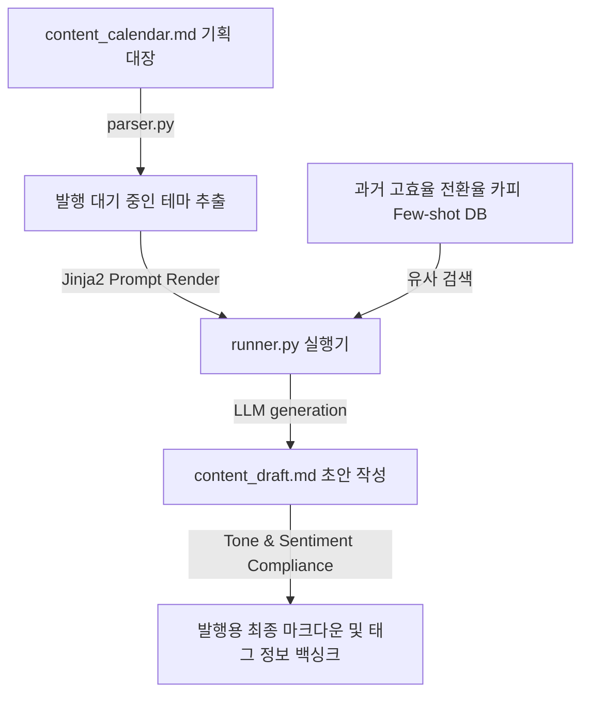

# 📢 마케팅 카피라이팅 및 뉴스레터 발행 하네스 설계서 (Marketing & Newsletter Harness)

본 설계서는 콘텐츠 기획 대장 및 키워드 테이블로부터 타겟 채널(블로그, 뉴스레터, SNS 광고 등)에 최적화된 마케팅 문안을 자동 집필하고, 성과가 증명된 과거의 카피 화법(Few-shot)을 투영하여 최종 배포본 원고를 완성하는 하네스 아키텍처 명세입니다.

---

## 🏗️ 1. 아키텍처 흐름

---

## 🗂️ 2. 데이터 컴포넌트 설계

### 2.1 콘텐츠 캘린더 및 발행 대장 (`content_calendar.md`)
발행할 마케팅 콘텐츠의 상세 스펙과 일정, 플랫폼 채널을 관리하는 단일 진실원(SSOT) 문서입니다.

| 캠페인 ID | 채널 / 플랫폼 | 타겟 고객 및 핵심 메시지 | 핵심 타겟 키워드 | 원고 타겟 분량 | 현재 상태 |
| :--- | :--- | :--- | :--- | :--- | :--- |
| MKT-01 | 이메일 뉴스레터 | 2030 직장인 대상 시간 관리 앱 런칭 | 생산성, 미라클모닝, 갓생 | 2,000자 내외 | `🟢 발행 완료` |
| MKT-02 | 블로그 (네이버) | 직장인 스트레스 해소에 유용한 요가 동작 | 직장인 우울증, 홈트, 요가 | 3,000자 내외 | `🔴 원고 대기` |
| MKT-03 | 인스타그램 광고 | 무릎 보호대 특허 기능 및 사용 후기 | 헬스 무릎 통증, 스쿼트 보호대 | 500자 이내 | `🟡 초안 감수 중` |

---

## ⚙️ 3. 코드 엔진 설계 및 분기

1. **`parser.py` (캠페인 스캐너)**:
   - `content_calendar.md` 파일에서 `현재 상태`가 `🔴 원고 대기`인 기획 행을 포착하여 타겟 오디언스, 키워드, 타겟 글자 수 사양을 파싱합니다.
2. **`humanizer_db.py` (최고 성과 전환 카피 Few-shot DB)**:
   - 과거에 발송했던 이메일 중 오픈율 30%를 넘긴 최고 효율 뉴스레터나, 광고 클릭률(CTR)이 평균 대비 2배 이상 높았던 실제 광고 문안 세트를 유사도 기반으로 로드합니다.
3. **`runner.py` (고감도 카피라이팅 엔진)**:
   - 각 플랫폼 규정(네이버 블로그의 SEO 노출 규칙, 인스타그램의 가독성 좋은 줄 바꿈 및 해시태그 배치 룰)을 `.agents/rules/` 지침으로부터 결합합니다.
   - LLM이 Few-shot의 흡입력 있는 스토리텔링 화법을 그대로 살려 최종 본문을 생성하게 한 뒤 `content_draft.md`에 배치하고 진척 상태를 `🟡 초안 감수 중`으로 변경합니다.
