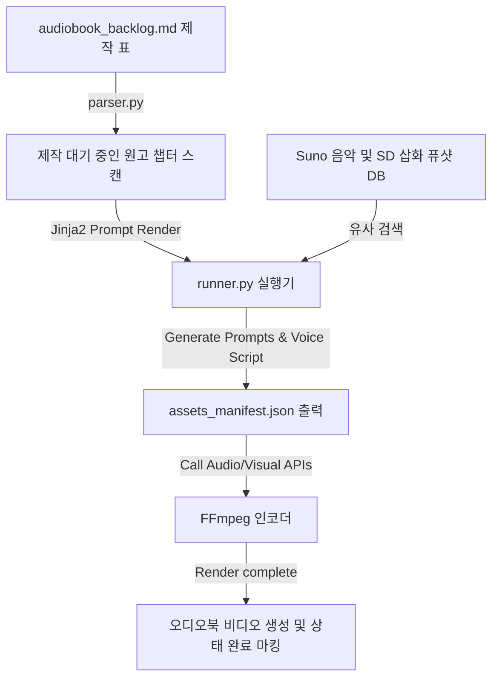

# 🎙️ 멀티모달 오디오북 제작 하네스 설계서 (MM-StoryAgent Harness)

본 설계서는 완성된 소설 텍스트 원고를 장별로 스캔하여, 각 장면에 부합하는 삽화(Image), 목소리(TTS Audio), 배경음악(Suno Music)의 프롬프트와 오디오 파일을 동시 조율하여 한 편의 오디오북 비디오로 자동 인코딩하는 하네스 아키텍처 명세입니다. (MM-StoryAgent 오픈소스 모델 기반, 학술 검증 완료)

---

## 🏗️ 1. 아키텍처 흐름

---

## 🗂️ 2. 데이터 컴포넌트 설계

### 2.1 오디오북 제작 백로그 대장 (`audiobook_backlog.md`)
제작할 챕터별 사운드 에셋 및 비디오 빌드 현황을 관리하는 단일 진실원(SSOT) 문서입니다.

| 챕터 ID | 챕터명 및 원고 경로 | TTS 성우 타입 | 배경음 분위기 (Suno) | 삽화 화풍 (SDXL) | 현재 상태 |
| :--- | :--- | :--- | :--- | :--- | :--- |
| CH-01 | `01_본문/001화_프롤로그.md` | 차분하고 묵직한 중년 남성 | 장엄한 판타지 오케스트라 | 무협 판타지 한국화 풍 수묵 일러스트 | `🟢 제작 완료` |
| CH-02 | `01_본문/010화_비림의_사육.md` | 날카롭고 매혹적인 젊은 남성 | 차갑고 배덕적인 가야금/어쿠스틱 | 어둡고 뇌쇄적인 동양풍 일러스트 | `🔴 제작 대기` |

---

## ⚙️ 3. 코드 엔진 설계 및 분기

1. **`parser.py` (멀티모달 소스 스캐너)**:
   - `audiobook_backlog.md`에서 `현재 상태`가 `🔴 제작 대기`인 챕터의 마크다운 원고를 파싱하여, 단락별 감정 태그(슬픔, 긴장, 분노 등)와 시간 단위를 계산하여 축적합니다.
2. **`humanizer_db.py` (멀티모달 프롬프트 퓨샷 DB)**:
   - 각 감정 단락과 가장 잘 공명되는 Suno AI 스타일 키워드 조합 및 삽화 생성용 프롬프트 스타일 시트(Few-shot)를 매칭하여 로드합니다.
3. **`runner.py` (멀티모달 코디네이터 및 빌더)**:
   - 각 감정 단락을 음성 데이터로 변환할 TTS 스크립트 파일과 Suno 음악 생성 프롬프트, 삽화 프롬프트 목록이 정의된 `assets_manifest.json` 파일을 작성합니다.
   - 외부 API나 로컬 추론 모델(TTS, SD, Suno)을 순차 구동하여 오디오 및 이미지 에셋을 수집한 뒤, **FFmpeg 라이브러리 명령어를 서브프로세스로 기동하여 단락 타임라인에 맞게 싱크를 맞춘 비디오 파일(`.mp4`)로 최종 머지(Merge)**하고 상태를 업데이트합니다.
