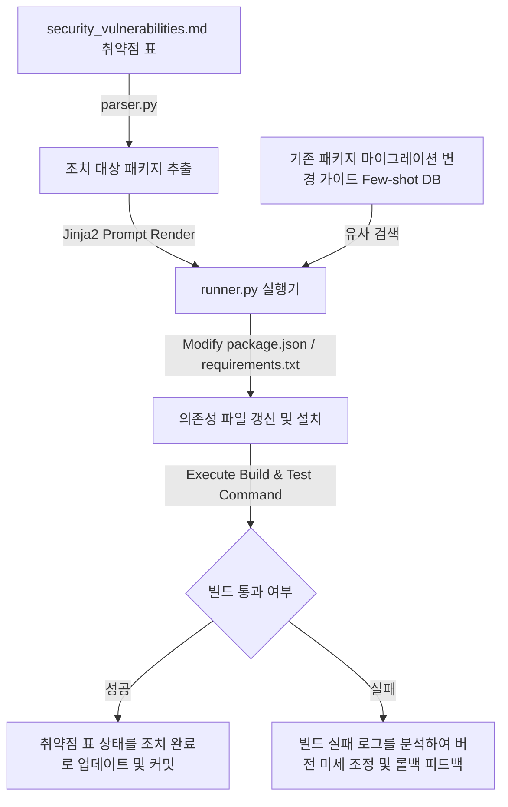

# 🛡️ 취약점 보안 진단 및 조치 하네스 설계서 (Security Hardening Harness)

본 설계서는 패키지 의존성 취약점 감지 도구가 보고한 위험 라이브러리 목록으로부터 패키지 버전을 자동으로 업그레이드하고, 사내 빌드 명령과 테스트를 연동 실행하여 안전성 검증을 거쳐 최종 갱신하는 의존성 보안 하네스 아키텍처 명세입니다.

---

## 🏗️ 1. 아키텍처 흐름

---

## 🗂️ 2. 데이터 컴포넌트 설계

### 2.1 보안 취약점 조치 이력 대장 (`security_vulnerabilities.md`)
보안 취약점 스캐너가 보고한 항목과 에이전트의 패키지 패치 진행 상황을 관리하는 단일 진실원(SSOT) 문서입니다.

| 취약점 ID | 패키지명 | 위험도 | 현재 버전 | 조치 대상 안전 버전 | 현재 상태 |
| :--- | :--- | :--- | :--- | :--- | :--- |
| SEC-01 | `lodash` | `🔴 High` | `4.17.15` | `4.17.21` | `🟢 패치 완료` |
| SEC-02 | `axios` | `🔴 High` | `0.19.0` | `1.6.0` (메이저 업데이트) | `🔴 조치 필요` |
| SEC-03 | `django` | `🟡 Medium`| `3.2.1` | `3.2.20` | `🟡 빌드 테스트 중` |

---

## ⚙️ 3. 코드 엔진 설계 및 분기

1. **`parser.py` (취약점 감지기)**:
   - `security_vulnerabilities.md` 파일에서 `현재 상태`가 `🔴 조치 필요` 또는 `🟡 빌드 테스트 중`인 패키지명과 위험 버전 스펙을 추출합니다.
2. **`humanizer_db.py` (API 변경 가이드 Few-shot DB)**:
   - 패키지의 메이저 업그레이드로 인해 브레이킹 체인지(Breaking Change)가 발생했을 때 참조할 수 있는 API 마이그레이션 가이드 혹은 과거 패키지 호환 조치 이력(Few-shot)을 가져옵니다.
3. **`runner.py` (의존성 수복 및 빌더)**:
   - Jinja2 템플릿에 맞춰 의존성 정의 파일(`package.json` 또는 `requirements.txt`)을 업데이트하고 패키지 설치 명령(`npm install` / `pip install`)을 실행합니다.
   - 즉각 **[통합 빌드 및 유닛 테스트 명령어]**를 실행하여, 판올림으로 인한 코드 충돌 및 깨짐을 테스트합니다.
   - 테스트 통과 시 취약점 대장 상태를 `🟢 패치 완료`로 고치고 버전을 동기화하며, 빌드 실패 시 에러 로그를 분석하여 호환 가능한 미세 버전을 자동 스왑 테스트합니다.
