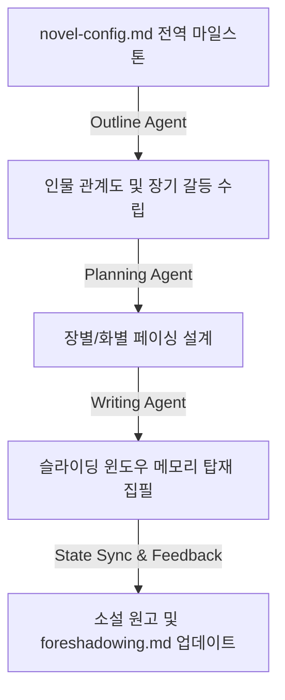

# 📖 초장편 소설 집필 하네스 설계서 (StoryWriter Harness)

본 설계서는 초장편 소설(Long-form Fiction) 집필 중 발생하기 쉬운 설정 망각 및 맥락 꼬임(Context Drift) 현상을 방지하기 위해, 칭화대 KEG 연구진의 StoryWriter 아키텍처를 기반으로 설계된 에이전트 하네스 명세입니다. (GitHub 오픈소스 및 학술 검증 완료)

---

## 🏗️ 1. 아키텍처 흐름

---

## 🗂️ 2. 데이터 컴포넌트 설계

### 2.1 에피소드 메모리 맵 (`episode_memory.md`)
장기 서사의 일관성을 유지하기 위해 화별 진행 시점의 전역 타임라인과 캐릭터 상태를 실시간 스캔하는 단일 진실원(SSOT) 문서입니다.

| 회차 | 주요 사건 요약 (마일스톤) | 활성화된 복선 (F-ID) | 소요 공간 / 씬 배경 | 갱신된 캐릭터 상태 |
| :--- | :--- | :--- | :--- | :--- |
| 009화 | 백운이 설하에게 은밀히 정신침을 진맥함 | F-01 (설하 예속 시작) | 청운의원 밤 | 설하: 한기 억제, 백운에 대한 의존도 10% |
| 010화 | 습격한 무림맹 자객 처단 및 백운의 딜레마 | F-01 (예속 진행) | 청운의원 앞마당 안개 | 설하: 기혈 공명, 백운: 도덕적 갈등 자각 |

---

## ⚙️ 3. 코드 엔진 설계 및 분기

1. **`parser.py` (슬라이딩 윈도우 메모리 파서)**:
   - `episode_memory.md`에서 현재 타겟 회차(예: 11화)를 기준으로 직전 3개 회차의 주요 사건과 인물 변화만을 슬라이딩 윈도우 방식으로 추려내어 컴파일러에 전달합니다. (전체 원고를 매번 전달하여 발생하는 토큰 낭비 및 집중력 분산 차단)
2. **`humanizer_db.py` (장기 문체 유지 퓨샷 DB)**:
   - 작가의 이전 고유 원고 문장들을 벡터 DB에 적재하고, 현재 진행할 장면의 카테고리(예: 격렬한 전투, 서정적 묘사 등)와 동일한 최우수 작성 씬 퓨샷을 매칭합니다.
3. **`runner.py` (순차 기획-집필-백싱크기)**:
   - **Outline Agent ➡️ Planning Agent ➡️ Writing Agent**의 3단 롤을 수행합니다.
   - Jinja2 템플릿에 타임라인 메모리와 퓨샷 씬을 결합하여 다음 화 본문을 자동 작성하고, 발생한 캐릭터 심경 변화와 서사 진행 요약을 `episode_memory.md` 및 `foreshadowing.md`에 실시간으로 업데이트 동기화합니다.
