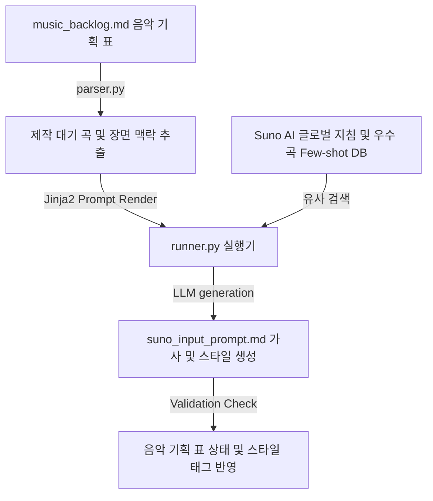

# 🎵 Suno AI 노래 및 OST 제작 하네스 설계서 (Suno OST Generation Harness)

본 설계서는 웹툰 장면이나 유튜브 영상의 스토리보드/음악 요구사항 테이블로부터 장면 분위기에 맞는 음악 스타일(장르, 악기, 보컬 구조) 프롬프트와 감성 가사를 자동으로 조립하여 Suno AI 생성 규격에 맞춰 출력하는 하네스 아키텍처 명세입니다.

---

## 🏗️ 1. 아키텍처 흐름



---

## 🗂️ 2. 데이터 컴포넌트 설계

### 2.1 장면별 음악 기획 대장 (`music_backlog.md`)
제작할 음악의 타겟 씬(Scene) 정보와 사운드 사양을 표(Table)로 관리하는 단일 진실원(SSOT) 문서입니다.

| 곡 ID | 타겟 장면 및 분위기 | 음악 장르 | 템포 / 보컬 성향 | 가사 주제 키워드 | 현재 상태 |
| :--- | :--- | :--- | :--- | :--- | :--- |
| OST-01 | 주인공 각성 및 전투 개시 (장엄함) | 판타지 심포닉 록 | Fast / 남성 테너 보컬 | 부활, 심판, 검의 불꽃 | `🟢 생성 완료` |
| OST-02 | 두 남녀의 애절한 이별 (슬픔, 비) | 서정적 어쿠스틱 발라드 | Slow / 애절한 여성 보컬 | 빗방울, 흔적, 지워진 기억 | `🔴 프롬프트 대기` |
| OST-03 | 사이버펑크 도시 추격전 (긴장감) | 신스웨이브 / 일렉트로 | Very Fast / 보컬 없음 (Inst) | - | `🟡 조율 중` |

---

## ⚙️ 3. 코드 엔진 설계 및 분기

1. **`parser.py` (장면 분위기 스캐너)**:
   - `music_backlog.md` 파일에서 `현재 상태`가 `🔴 프롬프트 대기`인 씬의 감정선, 악기 선호도, 가사 주제를 파싱하여 컨텍스트로 전달합니다.
2. **`humanizer_db.py` (Suno AI 최적화 지침 및 퓨샷 DB)**:
   - 워크스페이스에 기 구축된 **[sunoai-global-prompt.md](file:///.agents/workflows/sunoai-global-prompt.md)**의 GMIV 공식(Genre, Mood, Instrument, Vocal) 및 메타태그 가이드라인을 참조합니다.
   - 기존에 Suno AI v5에서 청량하고 고품질로 렌더링에 성공했던 스타일 태그 조합과 가사 메타태그 구조(Few-shot)를 매칭하여 최우선 추천 스타일을 도출합니다.
3. **`runner.py` (Suno 프롬프트 젠 엔진)**:
   - Jinja2 템플릿을 사용하여 Suno AI 입력창 규격(Style 120자 제한, Lyrics 3,000자 제한)에 완벽하게 맞춘 가사와 음악 메타 프롬프트 패키지를 출력하고, `music_backlog.md` 상태를 업데이트합니다.
   - **출력 규격 예시:**
     - **Style of Music (120자 내외):** `melancholic acoustic ballad, slow tempo, weeping acoustic guitar, warm cello, emotional female vocal, 90bpm`
     - **Lyrics (메타태그 조립형):**
       ```text
       [Intro]
       [Acoustic Guitar solo]
       
       [Verse 1]
       창가에 흐르던 차가운 빗방울...
       ```
