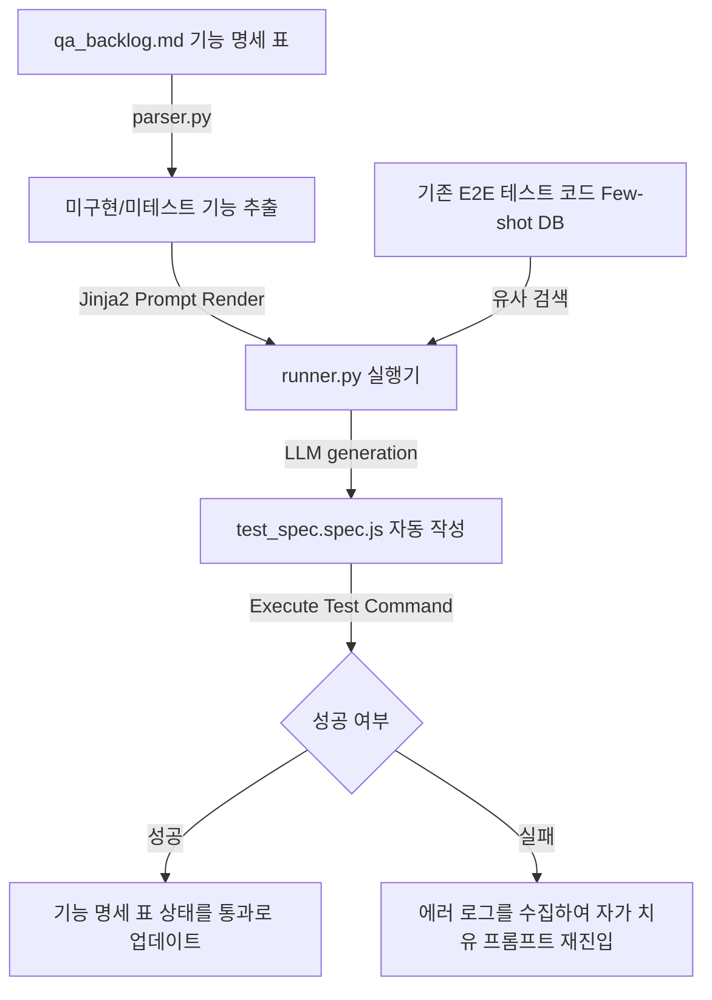

# 🧪 E2E 자동화 테스트 QA 하네스 설계서 (Test Automation Harness)

본 설계서는 기능 요구사항 명세서 표로부터 실시간 E2E(End-to-End) 테스트 스크립트(Playwright, Selenium 등)를 자동으로 생성하고, 가동된 테스트 에러 로그를 분석하여 코드를 자가 치유(Self-healing)한 뒤 성공 상태를 동기화하는 QA 하네스 아키텍처 명세입니다.

---

## 🏗️ 1. 아키텍처 흐름

---

## 🗂️ 2. 데이터 컴포넌트 설계

### 2.1 기능 명세 및 QA 진행 대장 (`qa_backlog.md`)
애플리케이션 기능 목록과 E2E 테스트 통과 여부를 실시간 추적하는 단일 진실원(SSOT) 문서입니다.

| 기능 ID | 핵심 기능명 | 테스트 대상 페이지 경로 | 주요 검증 동작 (Assert) | 현재 상태 |
| :--- | :--- | :--- | :--- | :--- |
| QA-01 | 회원가입 기능 | `/join` | 유효 이메일 입력 시 가입 승인 얼럿 감지 | `🟢 통과` |
| QA-02 | 장바구니 담기 | `/products/123` | 담기 클릭 시 상단 카트 카운트가 1 증가함 | `🔴 테스트 미실행` |
| QA-03 | 결제 진행 (카드) | `/checkout` | PG 팝업 호출 및 승인 성공 응답 확인 | `🟡 실패 (디버깅 중)` |

---

## ⚙️ 3. 코드 엔진 설계 및 분기

1. **`parser.py` (테스트 타겟 스캐너)**:
   - `qa_backlog.md` 파일에서 `현재 상태`가 `🔴 테스트 미실행` 또는 `🟡 실패 (디버깅 중)`인 요구사항과 검증 동작 매뉴얼을 파싱하여 수집합니다.
2. **`humanizer_db.py` (우수 테스트 코드 퓨샷 DB)**:
   - 사내에서 가장 완벽하게 작동하는 모범 테스트 스크립트(Few-shot 코드)를 적재해두고, 현재 검증해야 할 동작 패턴(예: Form 입력, Click 이벤트, Alert 감지 등)과 가장 유사한 형태의 모범 실례 코드를 매칭해 가져옵니다.
3. **`runner.py` (E2E 코드 젠 및 자가 수복 엔진)**:
   - Jinja2 템플릿에 타겟 씬과 Few-shot 코드를 주입하여 테스트 스크립트를 빌드합니다.
   - 빌드 직후 테스트 러너 명령어(예: `npx playwright test`)를 서브프로세스로 자동 실행합니다.
   - 실패 시 터미널의 에러 로그를 캡처하여 **[에러 원인 분석 프롬프트]**로 재입력, 스크립트를 스스로 수정한 뒤 성공할 때까지 루프(최대 3회)를 돕고 성공 시 표 상태를 `🟢 통과`로 최종 갱신합니다.
