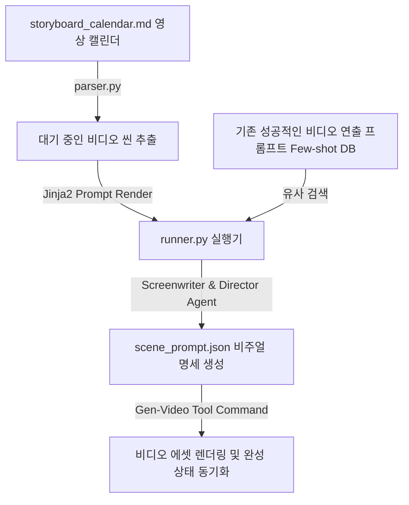

# 🎬 비디오 영상 제작 하네스 설계서 (ViMax Video Harness)

본 설계서는 텍스트 시나리오 기획안으로부터 스토리보드 시퀀스를 나누고 비주얼 프롬프트를 자동 추출하여 렌더링(Gen-Video) 명령을 동적으로 연계하는 비디오 제작 하네스 명세입니다. (홍콩대 ViMax 연구 아키텍처 기반, 학술 검증 완료)

---

## 🏗️ 1. 아키텍처 흐름

---

## 🗂️ 2. 데이터 컴포넌트 설계

### 2.1 영상 스토리보드 및 제작 캘린더 (`storyboard_calendar.md`)
유튜브, 틱톡, 웹툰 예고편 등에 삽입할 영상 씬별 비주얼 설정과 에셋 제작 진척도를 추적하는 단일 진실원(SSOT) 문서입니다.

| 씬 ID | 주요 연출 내용 (Action) | 카메라 무빙 / 앵글 | 캐릭터 일관성 프롬프트 | 해상도 / 비 비율 | 현재 상태 |
| :--- | :--- | :--- | :--- | :--- | :--- |
| VID-01 | 백운이 어두운 방에서 정신침을 쥠 | Close-up / Slow Zoom-in | `백운: 흑발, 차가운 눈동자, 남색 한복` | 16:9 / 4K | `🟢 렌더링 완료` |
| VID-02 | 설하의 손끝에서 한기가 폭출함 | Extreme Close-up / Static | `설하: 은발, 백색 비단옷, 보랏빛 눈동자` | 16:9 / 4K | `🔴 렌더링 대기` |
| VID-03 | 자객들과의 안개 속 사투 | Wide shot / Fast Paning | `자객: 검은 복면, 혈흔 묻은 검` | 16:9 / 4K | `🟡 렌더링 중` |

---

## ⚙️ 3. 코드 엔진 설계 및 분기

1. **`parser.py` (비주얼 시놉시스 스캐너)**:
   - `storyboard_calendar.md`에서 `현재 상태`가 `🔴 렌더링 대기`인 비디오 씬 정보와 이전 씬과의 비주얼 흐름을 스캔해 옵니다.
2. **`humanizer_db.py` (비디오 연출 퓨샷 DB)**:
   - 기존 비디오 생성 인공지능(Sora, Runway Gen-3 등)에서 모션 디포메이션(일그러짐) 없이 높은 화질로 출력하는 데 성공했던 최적의 렌더링 키워드 템플릿(Few-shot)을 로드합니다.
3. **`runner.py` (멀티모달 렌더링 컨트롤러)**:
   - **Screenwriter Agent (시나리오 빌드) ➡️ Director Agent (비주얼 프롬프트 정제) ➡️ Producer Agent (렌더링 API 호출)** 구조로 작동합니다.
   - LLM이 캐릭터의 외모 일관성을 보존하기 위한 참조 해시(LORA 등)와 카메라 구도 명령을 조합한 최종 `scene_prompt.json`을 내보냅니다.
   - 직후 비디오 렌더링 커맨드를 서브프로세스로 기동하여 파일을 저장하고, 캘린더 상태를 `🟢 렌더링 완료`로 전환합니다.
