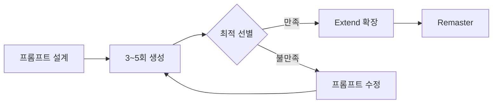

# 🎵 Suno AI 글로벌 지침서 (Global Production Guide)

> **최종 갱신:** 2026-03-27 | **대상 버전:** Suno v5  
> 본 문서는 Suno AI를 활용한 음악 제작 전반의 **프롬프트 설계, 메타태그 활용, 세팅 최적화, 품질 관리** 워크플로우를 정의한다.

---

## 목차

1. [핵심 원칙](#1-핵심-원칙)
2. [스타일 프롬프트 설계 (GMIV 공식)](#2-스타일-프롬프트-설계-gmiv-공식)
3. [메타태그 체계 (Metatags System)](#3-메타태그-체계-metatags-system)
4. [보컬 디자인](#4-보컬-디자인)
5. [악기 편곡 (Instrumentation)](#5-악기-편곡-instrumentation)
6. [곡 구조 설계 (Song Structure)](#6-곡-구조-설계-song-structure)
7. [고급 프롬프트 테크닉](#7-고급-프롬프트-테크닉)
8. [v5 세팅 가이드](#8-v5-세팅-가이드)
9. [장르별 레시피 (Genre Recipes)](#9-장르별-레시피-genre-recipes)
10. [품질 관리 및 후처리](#10-품질-관리-및-후처리)
11. [산출물 관리 규칙](#11-산출물-관리-규칙)
12. [안티패턴 (금지 사항)](#12-안티패턴-금지-사항)

---

## 1. 핵심 원칙

> **"스타일은 소리를 결정하고, 가사는 이야기를 전달한다. 이 둘을 절대 혼합하지 마라."**

| 원칙 | 설명 |
|------|------|
| **스타일/가사 분리** | `Style Prompt`에는 사운드만, 가사 입력란에는 텍스트와 구조 태그만 |
| **영문 프롬프트 우선** | 프롬프트는 영문, 가사는 한국어/다국어 자유 |
| **3~5 핵심 디스크립터** | 과부하 방지를 위해 묘사어 3~5개 제한 |
| **감정 우선 배치** | 프롬프트 첫 단어는 감정/분위기로 시작 |
| **반복 실험** | 동일 프롬프트로 3~5회 생성 후 최적 선별 |


---

## 2. 스타일 프롬프트 설계 (GMIV 공식)

```
[Mood] [Genre] with [Lead Instrument] and [Supporting Instruments], [Tempo], [Key], [Vocal Type], [FX/Atmosphere]
```

| 축 | 설명 | 예시 |
|----|------|------|
| **G** (Genre) | 장르 규정 | `Indie Folk`, `Synthwave`, `K-pop Ballad` |
| **M** (Mood) | 감정/분위기 | `Hopeful`, `Melancholic`, `Aggressive` |
| **I** (Instruments) | 핵심 악기 | `Piano`, `808 Sub Bass`, `Acoustic Guitar` |
| **V** (Vocals) | 보컬 캐릭터 | `Warm female vocal`, `Raspy male singer` |

**예시:**
```
Hopeful K-pop Ballad with warm piano chords and lush orchestral strings,
slow tempo (72 BPM), D major, emotional female vocal with gentle vibrato,
cinematic reverb, wide stereo mix
```

---

## 3. 메타태그 체계 (Metatags System)

메타태그는 `[대괄호]`로 감싸며, 가사 입력란에서 각 섹션의 시작 줄에 배치한다.

### 3.1 구조 태그

`[Intro]` `[Verse 1]` `[Pre-Chorus]` `[Chorus]` `[Post-Chorus]` `[Bridge]` `[Outro]` `[Interlude]` `[Break]`

### 3.2 악기/솔로 태그

`[Guitar Solo]` `[Piano Solo]` `[Drum Fill]` `[Bass Drop]` `[Orchestral Swell]`

### 3.3 보컬 태그

`[Male Singer]` `[Female Singer]` `[Whispers]` `[Echoing Vocals]` `[Harmonized Chorus]` `[Spoken Word Verse]` `[Autotuned Delivery]` `[Raspy Lead Vocal]` `[Falsetto]` `[Belting]` `[Ad-lib]`

### 3.4 음향 효과 태그

`[Applause]` `[Birds Chirping]` `[Rain Sounds]` `[Crowd Cheering]` `[Silence]` `[Sighs]`

### 3.5 메타태그 스태킹

파이프 `|`로 복합 지시를 결합:

```
[Chorus | Harmonized Chorus | Female belting | Epic orchestral backing]
```

> [!TIP]
> 3~4개 이상의 결합은 AI 해석 혼란 가능. v5에서는 스태킹 정확도가 향상되었으나 과용 주의.

---

## 4. 보컬 디자인

### 장르별 보컬 레퍼런스

| 장르 | 보컬 프롬프트 |
|------|-------------|
| **발라드** | `Soft female voice with angelic tones and gentle vibrato` |
| **락/파워** | `Powerful rock vocal with controlled rasp, soaring high registers` |
| **재즈/R&B** | `Deep male voice, soulful delivery with emotional depth` |
| **힙합** | `Confident rap delivery with rhythmic flow, autotuned hooks` |
| **메탈** | `Aggressive vocal with guttural screams, occasional clean passages` |
| **팝** | `Bright autotuned pop vocal with layered harmonies` |

### 보컬 믹스 키워드

`dry vocal` · `ambient reverb` · `double-tracked vocal` · `intimate whisper-close mic` · `choir backing`


---

## 5. 악기 편곡 (Instrumentation)

### 에너지 곡선

```
[Intro]      ■□□□□   [Verse]     ■■□□□   [Pre-Chorus] ■■■□□
[Chorus]     ■■■■■   [Bridge]    ■■□□□   [Final C]    ■■■■■
[Outro]      ■■□□□
```

### 장르별 핵심 악기

| 장르 | 핵심 악기 |
|------|----------|
| **락발라드** | `emotional piano, clean guitar arpeggios, warm strings, distorted guitars (chorus)` |
| **동요** | `warm piano, glockenspiel, soft string pads, light percussion` |
| **메탈** | `heavy distorted guitars, deep bass, explosive drums, double kick` |
| **일렉트로닉** | `synth pads, 808 bass, side-chain kick, ambient textures` |
| **재즈** | `upright bass, muted trumpet, brushed drums, Rhodes piano` |
| **K-pop** | `punchy synth bass, trap hi-hats, bright synth stabs, vocal chops` |

---

## 6. 곡 구조 설계 (Song Structure)

### 장르별 구조

| 장르 | 권장 구조 |
|------|----------|
| **팝/K-pop** | Intro → V1 → PC → C → V2 → PC → C → Bridge → C → Outro |
| **발라드** | Intro → V1 → V2 → C → V3 → C → Bridge → Final C → Outro |
| **힙합** | Intro → V1 → Hook → V2 → Hook → V3 → Hook → Outro |
| **EDM** | Intro → Build → Drop → Breakdown → Build → Drop → Outro |


---

## 7. 고급 프롬프트 테크닉

### 7.1 `//` 주석 지시문

```
[Verse 1]
// Soft acoustic guitar only, intimate and quiet
달빛 아래 걸어가는 이 밤
```

v5에서는 `//` 주석의 해석 정확도가 향상되어 악기·에너지·보컬 톤 변화를 더 세밀하게 반영한다.

### 7.2 모듈식 프롬프트

```
[감정] Hopeful, Bittersweet  |  [장르] Indie Folk  |  [악기] Acoustic Guitar, Strings
[보컬] Warm Female Vocal      |  [믹스] Wide Stereo, Lo-fi Warmth
```

### 7.3 에너지 커브

```
Starts quiet and intimate, builds tension in the pre-chorus,
explodes into a massive wall-of-sound chorus, then fades gently into silence
```

### 7.4 장르 블렌딩

`Jazz + Death Metal` · `Country Trap` · `Classical Dubstep` · `K-pop + Bossa Nova`

### 7.5 아티스트 네이밍 회피

| ❌ 금지 | ✅ 대안 |
|--------|--------|
| `Sounds like Adele` | `Powerful female vocal with soulful depth and controlled belting` |
| `Like BTS` | `High-energy K-pop with synchronized harmonies and EDM drops` |

---

## 8. v5 세팅 가이드

### 기본 파라미터

| 파라미터 | 정통 (발라드/락/팝) | 실험적 (앰비언트/아방가르드) |
|---------|---------------------|---------------------------|
| **Weirdness** | `0.2 ~ 0.3` | `15 ~ 35` |
| **Style Influence** | `0.88 ~ 0.95` | `0.75 ~ 0.95` |


---

## 9. 장르별 레시피 (Genre Recipes)

> 아래는 각 장르의 **스타일 프롬프트 + 핵심 포인트**이다. 상세 구조 코드 블록은 실전 통합 프롬프트 파일에서 구체화한다.

### 🎹 한국 발라드

```
Emotional K-Ballad with warm piano, lush orchestral strings, gentle acoustic guitar,
slow tempo (68 BPM), Eb major, soft female vocal with breathy delivery and gentle vibrato,
cinematic reverb, spacious mix
```
**핵심:** 피아노 중심 Intro → 현악 빌드업 → 코러스 Orchestral 폭발 → Bridge 피아노 Solo → Final Chorus 반음 전조

### 🎸 모던 록

```
Driving Modern Rock with crunchy electric guitars, punchy drums, melodic bass lines,
fast tempo (140 BPM), A minor, powerful male vocal with controlled rasp,
tight compressed mix, arena-rock energy
```
**핵심:** 디스토션 리프 Intro → 클린 아르페지오 Verse → 풀 디스토션 Chorus → Bridge 앰비언트 → Guitar Solo → Final Chorus 더블 보컬

### 🎤 힙합/트랩

```
Hard-hitting Trap Beat with 808 sub bass, snappy hi-hats, dark synth pads,
tempo 145 BPM, D minor, confident male rapper with autotuned hook,
saturated low-end, crisp high frequencies
```
**핵심:** 다크 앰비언트 Intro → 래핀 Verse → 오토튠 Hook → Spoken Bridge → Fade Out

### 🌸 동요/키즈

```
Cheerful Children's Song with warm piano, sparkling glockenspiel, soft string pads,
light percussion, gentle ukulele, moderate tempo (110 BPM), C major,
clear bright child's voice, warm cozy mix
```
**핵심:** 글로켄슈필 Intro → 단순 멜로디 Verse → 따라 부르는 Chorus → 효과음 Bridge → 뮤직박스 Outro

---

## 10. 품질 관리 및 후처리

### 워크플로우



### Remaster 모드

| 모드 | 장르 | 효과 |
|------|------|------|
| **Subtle** | 발라드, 재즈 | 원곡 보존 + 미세 개선 |
| **Normal** | 팝, 록, K-pop | 선명도·밸런스 향상 |
| **High** | EDM, 메탈, 트랩 | 전체 리터칭, 저·고음 강화 |

> [!WARNING]
> `High` 모드는 발라드·어쿠스틱에서 감성을 해칠 수 있다. 반드시 `Subtle`부터 단계적으로.

---

## 11. 산출물 관리 규칙

| 유형 | 저장 위치 |
|------|----------|
| 프롬프트/가사 전략 | `sunoai/sunoai-prompt/` |
| 순수 가사/곡 결과물 | `sunoai/sunoai-lyrics/` |

**파일명:** `[장르]-[곡 제목]_통합_프롬프트.md`

**통합 프롬프트 필수 항목:**
곡 정보 · 스타일 프롬프트 · 보컬 디자인 · 악기 편곡 · 가사(메타태그 포함) · 앨범 커버 이미지 프롬프트 · Suno 세팅값

---

## 12. 안티패턴 (금지 사항)

| ❌ 금지 | ✅ 대안 |
|--------|--------|
| 스타일 프롬프트에 가사 삽입 | 스타일/가사 입력란 분리 |
| 아티스트 이름 직접 언급 | 사운드 특성으로 묘사 |
| 디스크립터 7개 이상 | 3~5개로 제한 |
| 한국어 스타일 프롬프트 | 영문 프롬프트 + 한국어 가사 |
| Remaster High를 발라드에 적용 | Subtle 또는 Normal 사용 |
| 메타태그 없이 가사만 입력 | 필수 구조 태그 배치 |