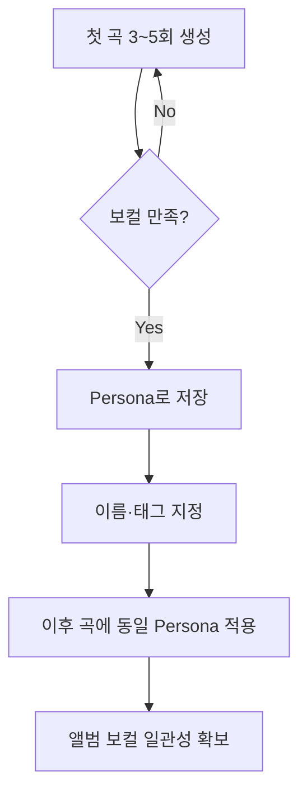

# 🎛️ Suno AI v5 Studio 심화 가이드

> **최종 갱신:** 2026-03-27 | **대상 버전:** Suno v5 / Studio 1.2+  
> 글로벌 프롬프트 설계·메타태그·장르별 레시피는 `/sunoai-global-prompt`를 참조한다.

---

## 1. Studio Timeline 조작법

Studio는 v5와 동시에 출시된 **생성형 DAW(Generative DAW)** 환경이다.

```
┌─────────────────── Suno Studio Timeline ───────────────────┐
│ Track 1: [Intro] [Verse1] [PreC] [Chorus] [V2] ...        │
│ Track 2: (Persona Vocal Layer)                              │
│ Track 3: (Added Instrumental Layer)                         │
│ BPM: 72 | Key: Eb Major | Time Sig: 4/4                   │
└─────────────────────────────────────────────────────────────┘
```

| 작업 | 방법 |
|------|------|
| **섹션 배치** | 생성된 섹션을 드래그하여 타임라인에 배치 |
| **섹션 교체** | 기존 섹션 → Alternates로 대체 버전 생성 → 최적 교체 |
| **크로스페이드** | 섹션 경계에 자동 크로스페이드, 길이 조절 가능 |
| **BPM/피치** | 프로젝트 전체 또는 섹션별 BPM·피치 변경 |
| **레이어링** | `Add Vocals` / `Add Instrumental`로 별도 트랙 추가 |

---

## 2. 권장 워크플로우

```
1. 전체 곡의 프롬프트(스타일 + 가사) 설계
2. v5로 3~5회 생성 → 최적 베이스 트랙 선별
3. Studio Timeline에서 불만족 섹션 식별
4. Alternates로 대체 버전 5~10개 생성
5. 최적 테이크 선택 → 크로스페이드 연결
6. Add Vocals / Add Instrumental로 레이어 추가
7. Remaster (Subtle → Normal 단계적) 적용
8. Stems Export → DAW 최종 마스터링
```

---

## 3. 멀티트랙 레이어링

1. **기본 트랙** — 메인 프롬프트로 뼈대 생성
2. **보컬 레이어** — `Add Vocals`로 하모니·백보컬·코러스 추가
3. **악기 레이어** — `Add Instrumental`로 현악·신스·퍼커션 보강
4. **Stems 분리** — 완성 트랙을 12 Stems로 분리 → DAW 정밀 편집

---

## 4. Persona 관리



| 항목 | 설명 |
|------|------|
| **Private** | 본인만 사용 가능 |
| **Public** | 누구나 해당 보컬 스타일 사용 가능 |
| **v5 개선** | 이전 버전의 보컬 드리프트(변조) 문제 크게 해결 |

---

## 5. Studio 1.2 고급 기능 (2026.02)

| 기능 | 활용 시나리오 |
|------|-------------|
| **Warp Markers** | 보컬 타이밍 어색할 때 미세 스트레칭·조절 |
| **Remove FX** | 리버브 과한 트랙에서 드라이 시그널 추출 → DAW에서 재적용 |
| **Alternates** | 코러스 불만족 시 동일 조건 5~10개 대체 버전 생성 |
| **Time Signature** | 왈츠(3/4), 6/8, 프로그레시브(5/4, 7/8) 등 변박자 지원 |

---

## 6. MILO-1080 Step Sequencer (Labs)

| 항목 | 상세 |
|------|------|
| **정의** | Labs 섹션의 16트랙 스텝 시퀀서 |
| **기능** | 프롬프트 사운드 생성, 클립 재사용, 내장 합성기 직접 설계 |
| **대상** | 프로덕션 경험자가 구조화된 음악 제작을 원할 때 |

---

## 7. Stems Export 상세

| 티어 | Stems 수 | 분리 항목 |
|------|---------|----------|
| **Pro** | 2 | Vocals + Instrumental |
| **Premier** | 최대 12 | Vocals, Drums, Bass, Melody, Harmony, Pads, FX 등 |

**DAW 연동:**
1. `Get Stems`로 분리
2. DAW(Logic Pro, Ableton, FL Studio) 임포트
3. EQ, 컴프레션, 리버브 정밀 조정
4. 마스터링 체인 → 최종 출력
