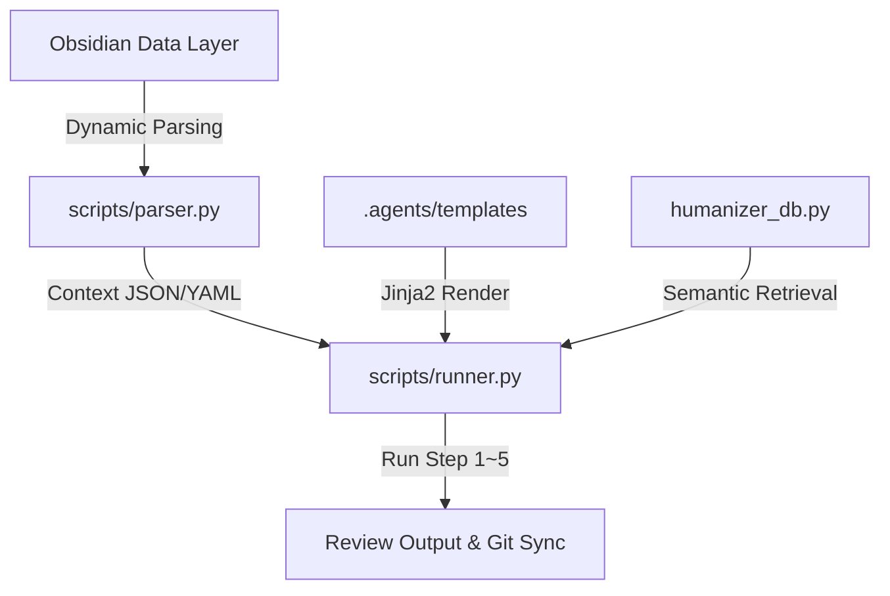

# 📐 하네스 에이전트 아키텍처 설계서 (Harness Agent Architecture)

본 설계서는 Obsidian 마크다운 데이터 구조와 LLM 지능형 에이전트 파이프라인을 융합하는 **하네스 에이전트 아키텍처**의 표준 레퍼런스 가이드입니다. 다른 소설이나 비소설 도메인의 하네스를 재구축할 때 참조용 뼈대로 사용할 수 있습니다.

---

## 🏗️ 1. 아키텍처 개요 (System Overview)

하네스 아키텍처는 데이터(Obsidian)와 생성 엔진(LLM)을 분리하여 **단일 진실원(SSOT, Single Source of Truth)**을 유지하는 구조로 설계되었습니다.



### 핵심 설계 원칙:
1. **정합성 보장 (State Lock):** 에이전트가 자체 판단으로 임의의 설정을 주입하지 못하도록 모든 외부 지식을 철저하게 억제하고 설정 문서의 정보로 구속합니다.
2. **토큰 최적화 (Token Diet):** 수십 개의 마크다운 파일을 통째로 읽는 대신, 현재 집필 대상 캐릭터와 미회수 복선만 동적으로 필터링하여 최소한의 토큰으로 최고의 문맥을 확보합니다.
3. **이식성 (Portability):** 로컬 특정 경로를 하드코딩하지 않고 매개변수를 통해 작품 폴더와 환경을 동적으로 주입받습니다.

---

## 🗂️ 2. 데이터 컴포넌트 설계 (Data Components)

### 2.1 메타데이터 제어기 (`novel-config.md`)
프로젝트의 전역 메타데이터 및 분석 대상을 선언합니다. 하네스 구동의 스위치 역할을 수행합니다.
```markdown
- 작품명: [텍스트]
- 장르: [장르 감지용 키워드: 무협/SF/판타지]
- 핵심 분석 캐릭터 리스트: ['이름1', '이름2', '이름3']
```

### 2.2 복선/떡밥 추적 대장 (`foreshadowing.md`)
스토리의 복선 회수 상태를 제어하며, 오직 미회수된 복선들만 컴파일 단계에 노출시킵니다.
* **상태 코드:**
  * `🔴 미회수`: 기획 단계에서 에이전트에게 강제 주입되어 해결(회수) 기획을 유도.
  * `🟡 진행 중`: 현재 진행 상황을 지속 추적.
  * `🟢 회수완료`: 다음 회차 컴포넌트 스캔 시 즉시 컨텍스트 주입 대상에서 완전 제외하여 **토큰 낭비 방지**.

---

## ⚙️ 3. 코드 엔진 설계 (Engine Code Components)

### 3.1 `parser.py` (컨텍스트 하이브리드 파서)
* **세로 마크다운 테이블 파싱:** 
  Obsidian 가독성을 위해 헤더가 세로형(`| 항목 | 내용 |`)으로 정렬된 표를 탐색하여 캐릭터 카드를 개별 딕셔너리로 축적합니다.
* **계층형 헤더 Splitting:** 
  전통적인 마크다운 헤더 구조(`### 인물명`)를 인식하여 정규식(Regex)을 통해 본문 텍스트를 인물별 정보로 분리 및 래핑합니다.

### 3.2 `humanizer_db.py` (문체 검색용 인메모리 벡터 DB)
* **ChromaDB 모드:** 
  로컬 임베딩 모델(`paraphrase-multilingual-MiniLM-L12-v2`)을 사용하여 현재 작성된 초고와 가장 문체적 유사성이 깊은 과거 고품질 연재분을 dynamic Few-shot 데이터로 긁어옵니다.
* **Fallback 엔진 모드:** 
  새로운 환경에서 PyTorch나 ChromaDB 패키지가 유실되었을 때 크래시 없이 구동되도록 **단어 교집합 기반 코사인 유사도 연산 백업 엔진**이 즉시 자동으로 기동됩니다.

### 3.3 `runner.py` (파이프라인 실행기)
* **장르 다형성 (Genre Polymorphism):** 
  작품 경로 하단의 `novel-config.md`를 스캔하여 장르 키워드에 따라 적합한 Mock 보고서 데이터를 동적으로 빌드해 출력하도록 설계되었습니다.

---

## 🔄 4. 다른 도메인/하네스 확장 가이드 (Extensibility Guide)

다른 종류의 문서 작성기나 타 장르 하네스를 만들고자 할 때 변경해야 하는 구성입니다.

1. **지침 파일 갱신 (`.agents/workflows/`)**:
   - `novel-episode-writing.md` 대신, 해당 비즈니스(예: `report-writing.md`, `code-generation.md`)에 부합하는 에이전트 가이드라인 작성.
2. **템플릿 변경 (`.agents/templates/`)**:
   - 프롬프트 제어판인 `.md.j2` 파일들의 변수 바인딩(`{{ characters_yaml }}`) 등을 수정하여 타겟 도메인 사양으로 프롬프트 구조 설계.
3. **파서 수정 (`scripts/parser.py`)**:
   - 새로 구성할 프로젝트의 마크다운 형식(예: 옵시디언 프런트매터 위주 vs 태그 위주)에 따라 파서 수집 정규식을 맞춤형으로 튜닝.
