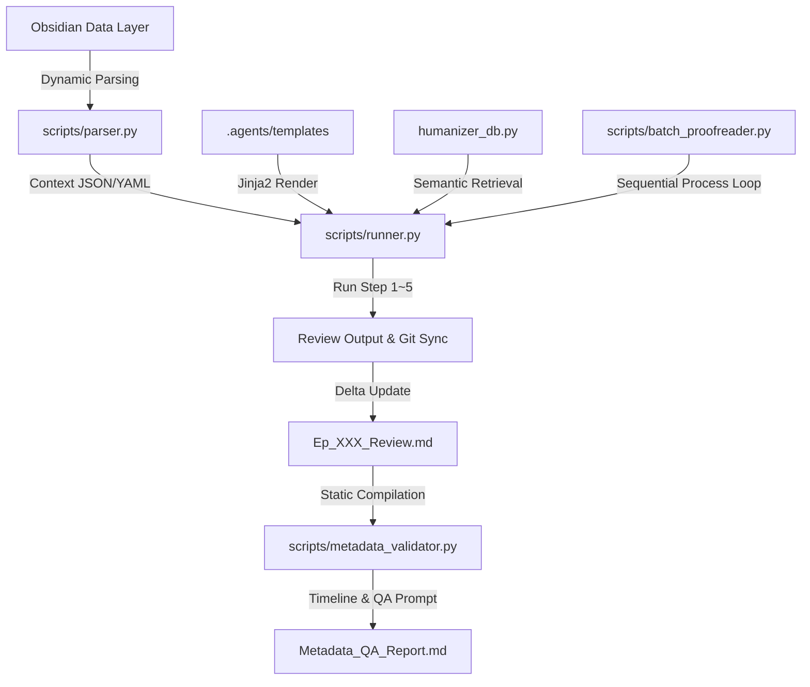

# 📐 하네스 에이전트 아키텍처 설계서 (Harness Agent Architecture)

본 설계서는 Obsidian 마크다운 데이터 구조와 LLM 지능형 에이전트 파이프라인을 융합하는 **하네스 에이전트 아키텍처**의 표준 레퍼런스 가이드입니다. 다른 소설이나 비소설 도메인의 하네스를 재구축할 때 참조용 뼈대로 사용할 수 있습니다.

---

## 🏗️ 1. 아키텍처 개요 (System Overview)

하네스 아키텍처는 데이터(Obsidian)와 생성 엔진(LLM)을 분리하여 **단일 진실원(SSOT, Single Source of Truth)**을 유지하며, 장기 연재 시의 **토큰 오버헤드와 모델 망각 현상**을 제어하도록 구성되어 있습니다.



### 핵심 설계 원칙:
1. **정합성 보장 (State Lock):** 에이전트가 자체 판단으로 임의의 설정을 주입하지 못하도록 모든 외부 지식을 철저하게 억제하고 설정 문서의 정보로 구속합니다.
2. **토큰 다이어트 (Token Diet):** 캐릭터 프로필 카드에서 장기 아크 필드를 소거(`compact=True`)하고, 떡밥 상세 서사(`description`)를 걸러내며, 과거 본문을 통째로 읽는 대신 **최근 3화 분량의 요약 대장**만 동적으로 윈도우 스캔하여 토큰을 절약합니다.
3. **스마트 캐릭터 필터링:** 전체 캐릭터 로스터를 전달하지 않고, 이번 에피소드 기획 및 리뷰 파일에서 실제 매칭되는 **활성 캐릭터 리스트(Active Characters)**만 추출 주입합니다.
4. **이식성 (Portability):** 로컬 특정 경로를 하드코딩하지 않고 매개변수를 통해 작품 폴더와 환경을 동적으로 주입받습니다.

---

## 🗂️ 2. 데이터 컴포넌트 설계 (Data Components)

### 2.1 메타데이터 제어기 (`novel-config.md`)
프로젝트의 전역 메타데이터 및 분석 대상을 선언합니다. 하네스 구동의 스위치 역할을 수행합니다.
```markdown
- 작품명: [텍스트]
- 장르: [장르 감지용 키워드: 무협/SF/판타지]
- 핵심 분석 캐릭터 리스트: ['이름1', '이름2', '이름3']
```

### 2.2 복선/떡밥 추적 대장 (`foreshadowing.md`)
스토리의 복선 회수 상태를 제어하며, 오직 미회수된 복선들만 컴파일 단계에 노출시킵니다.
* **상태 코드:**
  * `🔴 미회수`: 기획 단계에서 에이전트에게 강제 주입되어 해결(회수) 기획을 유도.
  * `🟡 진행 중`: 현재 진행 상황을 지속 추적.
  * `🟢 회수완료`: 다음 회차 컴포넌트 스캔 시 즉시 컨텍스트 주입 대상에서 완전 제외하여 **토큰 낭비 방지**.

### 2.3 에피소드 메모리 대장 (`episode_memory.md`)
각 회차별 주요 전개 사건과 인물들의 세부 상태 전이를 추적하는 단일 진실원 메모리 맵입니다.
* **동작 기전:** 1화부터 N화까지 전체 본문을 로드하는 대신, 타겟 에피소드 직전의 최근 **3화(window_size=3) 정보만 추출해 슬라이딩 윈도우** 형태로 프롬프트에 동적 삽입합니다. 이를 통해 소설 분량 증가에 비례하여 토큰이 누수되는 병목 현상을 원천 방지합니다.

---

## ⚙️ 3. 코드 엔진 설계 (Engine Code Components)

### 3.1 `parser.py` (컨텍스트 하이브리드 파서)
* **세로 마크다운 테이블 파싱:** 
  Obsidian 가독성을 위해 헤더가 세로형(`| 항목 | 내용 |`)으로 정렬된 표를 탐색하여 캐릭터 카드를 개별 딕셔너리로 축적합니다.
* **계층형 헤더 Splitting:** 
  전통적인 마크다운 헤더 구조(`### 인물명`)를 인식하여 정규식(Regex)을 통해 본문 텍스트를 인물별 정보로 분리 및 래핑합니다.
* **인코딩 강건성:** 파일 열기 함수에 `errors="ignore"` 예외 안전장치를 탑재하여 CP949, EUC-KR 등 타 인코딩 파일 파싱 시 발생하는 `UnicodeDecodeError` 크래시를 방지합니다.

### 3.2 `humanizer_db.py` (문체 검색용 인메모리 벡터 DB)
* **ChromaDB 모드:** 
  로컬 임베딩 모델(`paraphrase-multilingual-MiniLM-L12-v2`)을 사용하여 현재 작성된 초고와 가장 문체적 유사성이 깊은 과거 고품질 연재분을 dynamic Few-shot 데이터로 긁어옵니다.
* **Fallback 엔진 모드:** 
  새로운 환경에서 PyTorch나 ChromaDB 패키지가 유실되었을 때 크래시 없이 구동되도록 **단어 교집합 기반 코사인 유사도 연산 백업 엔진**이 즉시 자동으로 기동됩니다.

### 3.3 `runner.py` (파이프라인 실행기)
* **등장인물 스캔 및 활성 필터링:**
  기획 비트시트와 직전 에피소드 리뷰를 스캔하여 언급된 캐릭터만 골라내 `parser.py`에 넘깁니다. 
* **장르 다형성 (Genre Polymorphism):** 
  작품 경로 하단의 `novel-config.md`를 스캔하여 장르 키워드에 따라 적합한 Mock 보고서 데이터를 동적으로 빌드해 출력하도록 설계되었습니다.

### 3.4 `batch_proofreader.py` (배치 품질 검사 구동기)
* **동작 기전:** 여러 회차를 품질 검증할 때 한꺼번에 대량의 텍스트를 LLM에 밀어넣지 않고, `runner.py` 파이프라인을 격리된 프로세스로 에피소드 단위 루프를 돌려 실행합니다.
* **효과:** 모델의 중간 망각(Lost in the Middle)을 물리적으로 통제하고, 각 회차의 검사 결과(Delta)가 실시간으로 메모리에 누적 동기화되어 다음 에피소드로 인계되는 유기적 정합성 링크를 형성합니다.

### 3.5 `metadata_validator.py` (Delta 정합성 대조기)
* **동작 기전:** 본문을 스캔하지 않고, 각 에피소드 완료 시 자동 생성된 `Ep_XXX_Review.md` 내의 Delta 테이블(캐릭터 상태, 아이템 변동, 떡밥 진행)만 정적으로 추출 및 정렬합니다.
* **정적 및 동적 검증:**
  * 1차 정적 검사: 떡밥 코드(`F-03` 등)를 추적하여 최초 생성부터 최근 최종 상태까지의 생명 주기를 마크다운 요약본([Metadata_QA_Report.md](file:///03_줄거리/Metadata_QA_Report.md))으로 자동 빌드.
  * 2차 동적 검사: 수집된 경량 타임라인 데이터를 토대로 설정 모순 및 인과 붕괴를 진단하도록 LLM 프롬프트 파일([Metadata_QA_Prompt.md](file:///03_줄거리/Metadata_QA_Prompt.md))을 어셈블링.
